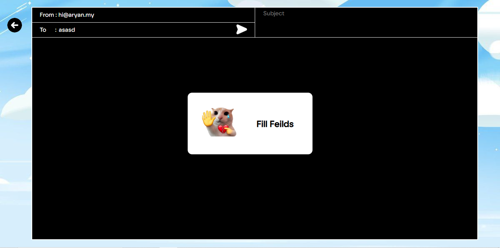

<p align="center"> 
</p>

<h1 align="center">Personal Email Site</h1>

<p align="center"> This is my personal email website. I will be hosting hi@aryan.my here. This is going to be my personal space
</p>

---


<p align="center">
  
  
  
  
  
  
</p>

> [!IMPORTANT]
> **AI Usage:** No AI coding assistants like Copilot, Cursor or Claude Code were used to write or edit the code for this project. ChatGPT was used only for occasional conceptual guidance and CSS references but not directly copy pasted except the javascript files, I used chatgpt to write the comose.js file for me that was edited by myself later accouring to my needs and The UI i made. I used AI to directly copy paste in other js files too that was arounf 70% of the content but reviewed by me.
>
>Reship Edit
I added the email inbox feature. the frontend is made by me but i used chatgpt to write the javascipt in the api and in root folder. The inbound resend api is pritty new so it took me a while to experiment and finnaly make it woorked.

> [!NOTE]
> I know that it doesnt have any gate right now. I will add this in upcoming few days and the read email feature too.
>
>in future ill add a feature to reply to the same email in thread.

## Screenshot



## Tech Stack
- HTML
- CSS
- Vanilla JavaScript
- Vercel API calls
- Resend
- Dot env
- Express in the start of the app

I made this using only custom css. No tailwind/frameworks and components

## Running Locally

1) Clone the repository:

```sh
 git clone https://github.com/aryanbrite/email-admin.git 
```

4) Set ENV

3) Use Vercel CLI to run this app

---

Made with love, bad decisions, and way too much free time.

© [The MIT License](LICENSE) - Aryan Brite
